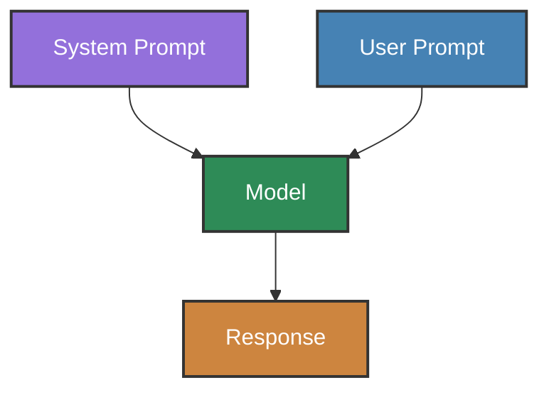
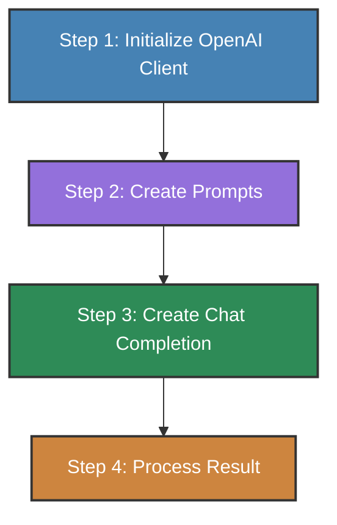

## Types of Prompts
A system prompt that tells them what task they are performing and what tone they should use
A user prompt -- the conversation starter that they should reply to

### Mermaid Diagram of Prompts
Both system and user prompts are sent to the model. The model then generates a response.


## OpenAI Prompting Basics with ChatGPT
```python
# imports
import os
import requests
from dotenv import load_dotenv
from bs4 import BeautifulSoup
from IPython.display import Markdown, display
from openai import OpenAI

# load the environment variables
load_dotenv()
api_key = os.getenv('OPENAI_API_KEY')

# Check the key
if not api_key:
    print("No API key was found - please head over to the troubleshooting notebook in this folder to identify & fix!")
elif not api_key.startswith("sk-proj-"):
    print("An API key was found, but it doesn't start sk-proj-; please check you're using the right key - see troubleshooting notebook")
elif api_key.strip() != api_key:
    print("An API key was found, but it looks like it might have space or tab characters at the start or end - please remove them - see troubleshooting notebook")
else:
    print("API key found and looks good so far!")

# Step 1: Initialize the OpenAI client
openai = OpenAI() # or OpenAI(api_key=api_key)

# Step 2: Create the prompts
messages = [
    {"role": "system", "content": system_prompt},
    {"role": "user", "content": user_prompt}
]

# Step 3: Create a chat completion
response = openai.chat.completions.create(
    model = "gpt-4o-mini",
    messages = messages
)

# Step 4: Print the result
content = response.choices[0].message.content
display(Markdown(content)) # Display the content in a markdown format
```

### OpenAI API Flow Diagram
The following diagram illustrates the basic flow when using the OpenAI API for prompting:

