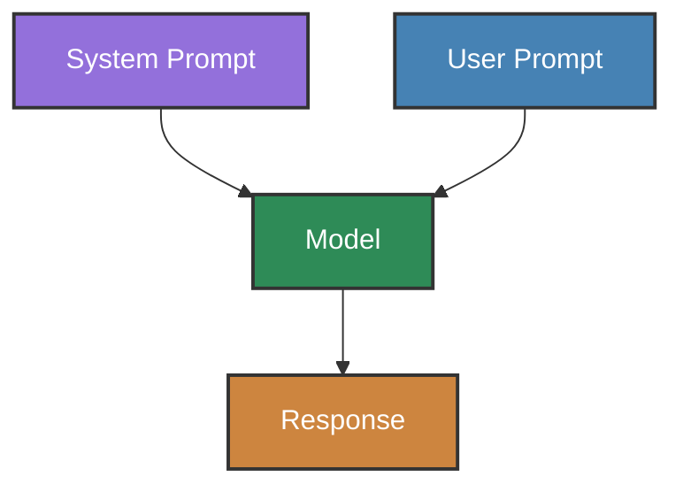
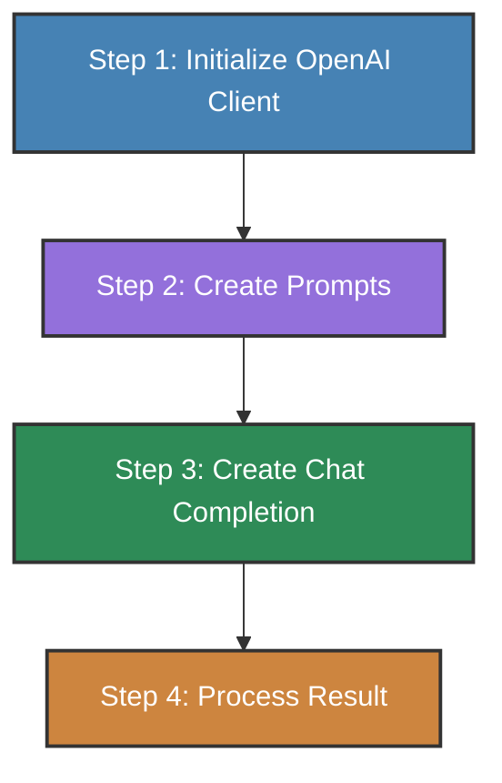
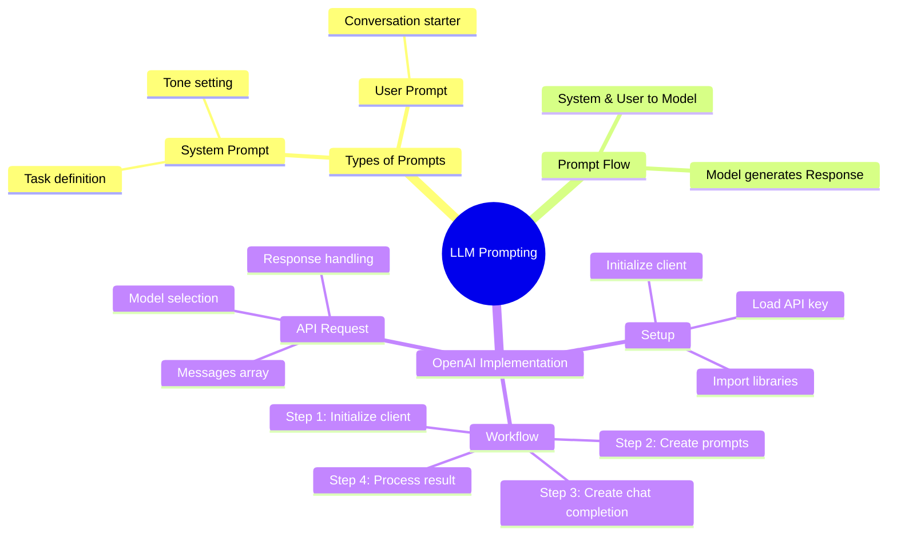

## Types of Prompts
A system prompt that tells them what task they are performing and what tone they should use
A user prompt -- the conversation starter that they should reply to

### Mermaid Diagram of Prompts
Both system and user prompts are sent to the model. The model then generates a response.


## OpenAI Prompting Basics with ChatGPT
```python
# imports
import os
import requests
from dotenv import load_dotenv
from bs4 import BeautifulSoup
from IPython.display import Markdown, display
from openai import OpenAI

# load the environment variables
load_dotenv()
api_key = os.getenv('OPENAI_API_KEY')

# Check the key
if not api_key:
    print("No API key was found - please head over to the troubleshooting notebook in this folder to identify & fix!")
elif not api_key.startswith("sk-proj-"):
    print("An API key was found, but it doesn't start sk-proj-; please check you're using the right key - see troubleshooting notebook")
elif api_key.strip() != api_key:
    print("An API key was found, but it looks like it might have space or tab characters at the start or end - please remove them - see troubleshooting notebook")
else:
    print("API key found and looks good so far!")

# Step 1: Initialize the OpenAI client
openai = OpenAI() # or OpenAI(api_key=api_key)

# Step 2: Create the prompts
messages = [
    {"role": "system", "content": system_prompt},
    {"role": "user", "content": user_prompt}
]

# Step 3: Create a chat completion
response = openai.chat.completions.create(
    model = "gpt-4o-mini",
    messages = messages
)

# Step 4: Print the result
content = response.choices[0].message.content
display(Markdown(content)) # Display the content in a markdown format
```

### OpenAI API Flow Diagram
The following diagram illustrates the basic flow when using the OpenAI API for prompting:



## Terminologies:
### Frontier Models
Pioneering models that are the first to market with a new technology or product.
1. Closed-Source Frontier
  a. GPT from OpenAI
  b. Claude from Anthropic
  c. Gemini from Google
  d. CommandR from Cohere
  5. Perplexity
2. Open-Source Frontier
  a. Llama from Meta
  b. Mixtral from Mistral
  c. Qwen from Alibaba Cloud
  d. Gemma from Google
  e. Phi from Microsoft

### Three ways to use models
1. `Chat interfaces` via ChatGPT
2. `Cloud APIs (LLM API)` - **Frmaeworks like LangChain**, **Managed AI cloud services**: Amazon Bedrock, Google Vertex, Azure ML
3. `Direct inference` - With the HuggingFace Transformers library. With Ollama to run locally.


## Python Class Basics
```python
class Website:
    """
    A utility class to represent a Website that we have scraped
    """
    # attributes
    url: str
    title: str
    content: str

    # constructor
    def __init__(self, title, url, content):
        """
        Create this Website object from the given url using the BeautifulSoup library
        """
        self.url = url
        response = requests.get(url)
        soup = BeautifulSoup(response.content, 'html.parser')
        self.title = soup.title.string if soup.title else "No title found"
        for irrelevant in soup.body(['script', 'style', 'img', 'input']): # remove all the irrelevant tags
            irrelevant.decompose()
        self.content = soup.body.get_text(separator='\n', strip=True)        
```

## Approaches to Prompting Ollama Locally
### Via Python Requests
Calls the Ollama API endpoint directly.
```python
# imports
import requests
from IPython.display import Markdown, display

OLLAMA_API = "http://localhost:11434/api/chat"
HEADERS = {"Content-Type": "application/json"}
MODEL = "llama3.2"

messages = [
    {"role": "user", "content": "Describe some of the business applications of Generative AI"}
]
payload = {
    "model": MODEL,
    "messages": messages,
    "stream": False
}

# Call the Ollama API endpoint directly
response = requests.post(OLLAMA_API, json=payload, headers=HEADERS)
print(response.json()['message']['content'])
```

### Via Ollama Package
```python
import ollama

response = ollama.chat(model=MODEL, messages=messages)
Markdown(response['message']['content'])
```

### Via OpenAI Python Library
```python
# There's actually an alternative approach that some people might prefer
# You can use the OpenAI client python library to call Ollama:

from openai import OpenAI
ollama_via_openai = OpenAI(base_url='http://localhost:11434/v1', api_key='ollama')

response = ollama_via_openai.chat.completions.create(
    model=MODEL,
    messages=messages
)

print(response.choices[0].message.content)
```

## Frontier models and their end-user UIs
* Open AI (Models: GPT, o1; Chat: ChatGPT)
* Anthropic (Models: Claude; Chat: Claude)
* Google (Models: Gemini, Chat: Gemini Advance)
* Cohere (Models: Command R+; Chat: Command R+)
* Meta (Models: Llama; Chat: meta.ai)
* Perplexity (Models: Perplexity; Search: Perplexity)

## Limitations of Frontier Models
* Specialized Domains: Most are not PhD level, but closing in (e.g. Claude 3.5 Sonnet)
* Recent events - Limited knowledge beyond traiing cut-off date
* Can confidently make mistakes - Some curious blindspots

## Exploring the Journey of AI: From Early Models to Transformers
1. Emergence of the Transformers Paper last 2017
2. GPT-3 last 2020
3. ChatGPT last 2022
6. Llama last 2023
4. Claude 3 last 2024
5. Gemini last 2024
6. Prompt Engineers (The rise (and fall?))
7. Custom GPTs
8. MS Copilot and Github Copilot
9. `Agentization` (like Github Copilot Workspace)

## Understanding LLM Parameters: From GPT-1 to Trillion-Weight Models
1. Weights and Parameters - quiet similar
2. Number of parameters in models (log scale)
    1. `GPT-1` = 117M weights
    2. `GPT-2` = 1.5B
    3. `Gemma` = 2.B
    4. `Mixtral` = 140B
    5. `Llama 3.1` = 8B / 70B / 405B
    6. `GPT-3` = 175B
    7. `GPT-4` = 1.76T

## Introducing Tokens and Training Techniques
### Early Training Techniques
* In the early days, neural networks were trained at the character level
  * Predict the next character in this sequence
  * Small vocab, but expects too much from the network
* Then neural networks were trained off words
  * Predict the next word in this sequence
  * Much easier to learn from, but leads to enormous vocabs with rare words omitted
* The breakthrough was to work with chunks of words called `tokens`
  * A middle ground: manageable vocab, and useful information for the neural network.
  * In addition, elegantly handles word stems

### GPT's Tokenizer
* GPT's Tokenizer [https://platform.openai.com/tokenizer](https://platform.openai.com/tokenizer)
  * The gap between words in included in a token.
  * GPTs struggered with creating tokens for math with more than 3 digits
  * Rule-of-thumb: in typical English writing:
    * 1 token ~ 4 characters
    * 1 token is ~0.75 words
    * So 1,000 tokens ~ 750 words
  * The collected works of Shakespeare are ~900,000 words of 1.2M tokens
  * Obviously the token count is higher for math, scientific terms and code

## How Context Windows Impact AI Language Models: Token Limits Explained
* Max number of tokens that the model can consider when geenrating the next token.
* Includes the original input prompt, subsequent conversation, the latest input prompt and almost all the out prompt.
* It governs how well the model can remember references, content and context.
* Particularly important for multi-shot prompting where the prompt includes examples,or for long conversations.

## LLM Leaderboard
* [https://vellum.ai/llm-leaderboard](https://www.vellum.ai/llm-leaderboard)
    * Contains a list of models with their Cost and Context Window Comparison
      * Claude 3.5 Sonnet has 200k tokens for its context window

## Prompting Techniques
1. **Zero Shot Prompting** - No examples provided, just the task.
2. **One Shot Prompting** - Provide the model with a single example of the desired output.
3. **Few Shot Prompting** - Provide the model with a few examples of the desired output.
4. **Chain of Thought Prompting** - Provide the model with a chain of thought process for the desired output.
5. **Self-Consistency** - Use multiple reasoning paths to reach a single conclusion.

## Streaming Results Example
Display text / markdown as it is generated from the model.
```python
def stream_brochure(company_name, url):
    stream = openai.chat.completions.create(
        model=MODEL,
        messages=[
            {"role": "system", "content": system_prompt},
            {"role": "user", "content": get_brochure_user_prompt(company_name, url)}
          ],
        stream=True
    )
    
    response = ""
    display_handle = display(Markdown(""), display_id=True)
    for chunk in stream:
        response += chunk.choices[0].delta.content or ''
        response = response.replace("```","").replace("markdown", "")
        update_display(Markdown(response), display_id=display_handle.display_id)
```

## Summary Mindmap
The following mindmap summarizes all the key concepts covered in these notes:

